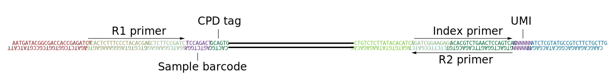

[](https://github.com/devin-AK/tradtools)
*Software to process and analyze DNA damage mapping data from TRAD-Seq*
<br>[Devin A. King](https://github.com/devin-AK), [Morrison Lab](https://www.morrisonlabatstanford.org/)

[![tradtools pipeline](https://img.shields.io/badge/TRAD--Seq-tradtools-brightgreen?logo=data%3Aimage%2Fsvg%2Bxml%3Bbase64%2CPD94bWwgdmVyc2lvbj0iMS4wIiBlbmNvZGluZz0idXRmLTgiPz4KPCEtLSBHZW5lcmF0b3I6IEFkb2JlIElsbHVzdHJhdG9yIDI1LjQuMSwgU1ZHIEV4cG9ydCBQbHVnLUluIC4gU1ZHIFZlcnNpb246IDYuMDAgQnVpbGQgMCkgIC0tPgo8c3ZnIHZlcnNpb249IjEuMSIgaWQ9IkxheWVyXzEiIHhtbG5zPSJodHRwOi8vd3d3LnczLm9yZy8yMDAwL3N2ZyIgeG1sbnM6eGxpbms9Imh0dHA6Ly93d3cudzMub3JnLzE5OTkveGxpbmsiIHg9IjBweCIgeT0iMHB4IgoJIHZpZXdCb3g9IjAgMCA1MiA1My4xNyIgc3R5bGU9ImVuYWJsZS1iYWNrZ3JvdW5kOm5ldyAwIDAgNTIgNTMuMTc7IiB4bWw6c3BhY2U9InByZXNlcnZlIj4KPHN0eWxlIHR5cGU9InRleHQvY3NzIj4KCS5zdDB7ZmlsbDojRkZGRkZGO30KPC9zdHlsZT4KPGc%2BCgk8cGF0aCBjbGFzcz0ic3QwIiBkPSJNMTkuNzgsNDMuNWMtMS4yLTAuNDItMi41LTEuNjctMi45Ni0yLjg2Yy0zLjUzLTguOTktNS4zNC0xOC4zNS01LjU3LTI4LjAyYy0wLjA2LTIuNCwwLjkzLTMuNDksMy4yNS0zLjY3CgkJYzMuNTEtMC4yOCw2Ljc3LTEuMSw5LjkyLTIuOTRjMS4zOS0wLjgxLDQuMzMtMC44MSw1LjQ0LDAuMTRjMi43LDIuMyw1Ljg5LDIuNzMsOC45NywzLjYxYzUuODcsMS42OSw2LjA4LDEuNjYsNC42OSw3LjU1CgkJYy0xLjg1LDcuODItMy41OSwxNS42MS0zLjc3LDIzLjdjLTAuMDgsMy42My0wLjYsMy45OC00LjM4LDQuMzhMMTkuNzgsNDMuNXoiLz4KPC9nPgo8L3N2Zz4K)](https://github.com/devin-AK/tradtools)


- [Quick Start](#quick-start)
- [Repository Contents](#repository-contents)
- [Introduction](#introduction)
- [Requirements](#requirements)
- [Installation](#installation)
- [Usage](#usage)
- [Details](#details)

Quick Start
===========
### Step 1: Check prerequisites
Open a terminal on a Linux system and type:
```
singularity --version
java -version
```

*Ensure that [singularity](https://sylabs.io/singularity/) (version &ge; 3.0) and [java](https://openjdk.org/) (&ge; 11) are installed. If there are any errors with the above commands, or the software versions are out-of-date, please see the [Installation](#installation) section below.*

### Step 2: Set up
Install [nextflow](https://www.nextflow.io/):
```
curl -s https://get.nextflow.io | bash
```

### Step 3: Run the pipeline on example data
```
./nextflow run devin-ak/tradtools
```

&nbsp;
&nbsp;

Repository Contents
===================
This GitHub repository contains the complete set of computational tools (including containerized bioinformatics tools, scripts, and pipelines) to process TRAD-Seq data. Additionally, scripts used to generate all figures in the corresponding publication [xxxxx](ERR) are included. Below is a brief description of select subfolders:

[assets](assets/): logos used for this website

[main.nf](main.nf): the main tradtools nextflow pipeline 

[manuscript](manuscript/): specific commands and scripts used to process data and generate figures in the accompanying manuscript

[tradtoolsR](tradtoolsR/): source code for tradtoolsR R package used to analyze processed (BED & bigwig) TRAD-Seq data

&nbsp;
&nbsp;

Introduction
============
TRAD-Seq is a high-throughput DNA sequencing technology to map DNA damage developed in the Morrison Lab at Stanford. tradtools is software for the processing of raw TRAD-Seq data (fastq) into signal tracks. The computational pipeline is structured around nextflow and singularity to facilitate scalable and reproducible computational analysis of TRAD-Seq data. The singularity container file (stored in the [sylabs cloud library](https://cloud.sylabs.io/library/devin_ak/default/tradtools)) is a carbon copy of the exact software used in the manuscript (including tools, e.g. bowtie2 and versions e.g. v2.5.0).

&nbsp;
&nbsp;

Requirements
============
 * Linux
 * java &ge; 11
 * singularity &ge; 3.0
 * nextflow &ge; 20

&nbsp;
&nbsp;

Installation
============
tradtools is designed to run on any Linux system where [singularity](https://sylabs.io/singularity/) is installed. Follow the singularity documentation to install. If you do not have root access, contact the system administrator for system-wide installation.
### Java
If needed, a specific java verion can be installed in a user's $HOME directory without root access. The location of this install needs to be specified in the `NXF_JAVA_HOME` environment variable to take effect:
```
cd $HOME
mkdir -p tools/java
cd tools/java
wget https://download.java.net/java/GA/jdk17.0.2/dfd4a8d0985749f896bed50d7138ee7f/8/GPL/openjdk-17.0.2_linux-x64_bin.tar.gz
tar -xzvf openjdk-17.0.2_linux-x64_bin.tar.gz
```
Make this environment variable persistent across sessions by adding it to your .bash_profile:
```
echo 'export NXF_JAVA_HOME=$HOME/tools/java/jdk-17.0.2' >> $HOME/.bash_profile
```
Restart the shell, and re-install nextflow.

### Nextflow
To install nextflow, run the following: 
```
curl -s https://get.nextflow.io | bash
```
This will create a file "nextflow" in the current working directory. It is useful to move this file to a directory in PATH.
For example, if you have root access:
```
sudo mv ./nextflow /usr/local/bin
```
If you don't have root access, move the file to a user bin directory and add that location to PATH:
```
mkdir -p $HOME/bin
mv ./nextflow $HOME/bin
echo 'export PATH=$PATH:$HOME/bin' >> $HOME/.bash_profile
```
Restart the shell for changes to take effect.

&nbsp;
&nbsp;

Usage
=====
General usage is:
```
nextflow run devin-ak/tradtools [ARGS]
```
&nbsp;&nbsp;&nbsp; where `[ARGS]` are command line arguments listed below.
```
nextflow run devin-ak/tradtools --R1 raw_R1.fastq.gz \
                                --R2 raw_R2.fastq.gz \
                                --genome1 hg19.fa.gz \
                                --genome2 lambda.fa.gz \
                                --blacklist1 hg19-blacklist.v2.bed.gz \
                                --adapters adapters.fa
```
&nbsp;&nbsp;&nbsp; *note*: The values of the parameters can be entered without quotes


  | ARG &nbsp; &nbsp; &nbsp; &nbsp; &nbsp; &nbsp; &nbsp; &nbsp; &nbsp; &nbsp; &nbsp; &nbsp; &nbsp; &nbsp; &nbsp; &nbsp; &nbsp; | Description |
  | ------------------ | ----------- |
  | `--R1`             | *REQUIRED*. The read **1** (R1) fastq file from the raw un-demultiplexed paired-end sequencing data. Can be Gzipped        |
  | `--R2`             | *REQUIRED*. The read **2** (R2) fastq file from the raw un-demultiplexed paired-end sequencing data. Can be Gzipped        |
  | `--genome1`        | *REQUIRED*. The reference genome fasta corresponding to the experimental organism (e.g. hg19.fa.gz). Must be Gzipped                    |
  | `--genome2`        | *REQUIRED*. The reference genome fasta file corresponding to the spike-in organism (e.g. lambda.fa.gz). Must be Gzipped                 |
  | `--blacklist1`     | An optional BED file (e.g. hg19-blacklist.v2.bed.gz) containing blacklisted regions for the experimental organism. Reads overlapping these regions will be removed from the final bigwig signal track    |
  | `--blacklist2`     | An optional blacklist BED file for the spike-in organism. Can be `null` (the default), in which case no blacklist will be used   |
  | `--adapters`       | *REQUIRED*. A fasta-formatted data file containing the IDs and sequences of TRAD-Seq adapters used for de-multiplexing. See examples|
  | `--results`        | The location of the output directory. Defaults to creating a subdirectory `results` in the directory from which the nextflow pipeline was launched  |
  
### Stanford Sherlock Users
Testing the pipeline on Sherlock is straightforward, as dependencies are already installed. Connect to a login node:
```
ssh <SUNetID>@sherlock.stanford.edu
```
Start an interactive session on a compute node using `sdev` (Don't use the login nodes for computing!)
```
sdev -m 16GB
```
Then perform the following steps:
```
module load java/17
nextflow run devin-ak/tradtools
```

&nbsp;
&nbsp;

Details
=======
TRAD-Seq library structure
[](https://raw.githubusercontent.com/devin-AK/tradtools/main/assets/svg/TRADSeq_library_structure.svg)

&nbsp;
&nbsp;

Maintenance
===========
### Singularity
To update the singularity file, build it from the up-to-date definition.
This will also update tradtoolsR installed in the SIF.
```
cd ~/tmp
rm tradtools_singularity_definition.def
wget https://github.com/devin-AK/tradtools/raw/main/containers/singularity/tradtools_singularity_definition.def
sudo singularity build trad.sif tradtools_singularity_definition.def
singularity test --no-home trad.sif
singularity sign trad.sif
singularity push trad.sif library://devin_ak/default/tradtools:0.1.0
```
  
  
